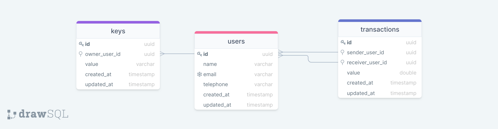

# Sending Pix

### Configuração

1. Clone o repositorio (git clone https://github.com/RosLuc/sending-pix)
2. Copie o arquivo `default.env` para `.env` na raiz.
3. Inicie o sistema executando: `docker-compose up`.
4. Rode as migrations executando: `docker exec sending-pix-container yarn migration:run`.
5. Desfrute!

### Diagrama do Banco de Dados
 

 

Para visualizar com mais detralhe acesse o [Link](https://drawsql.app/rl/diagrams/sandingpix).

***
Feito por [Rosendo Lucas](https://github.com/rosluc) com 💙.